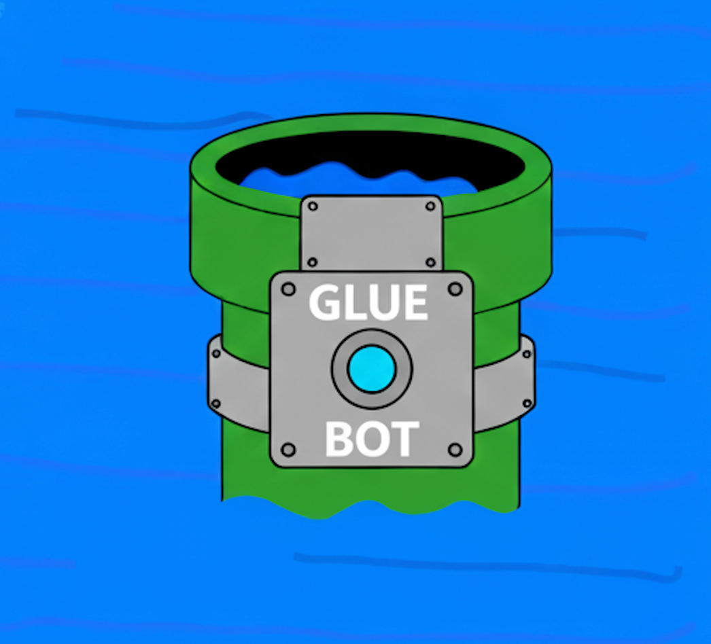
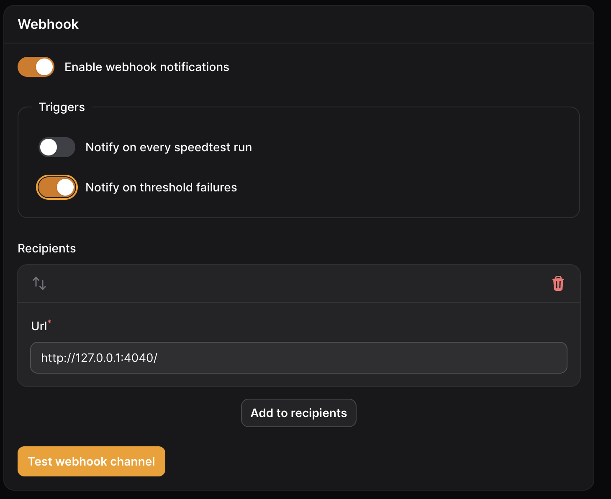
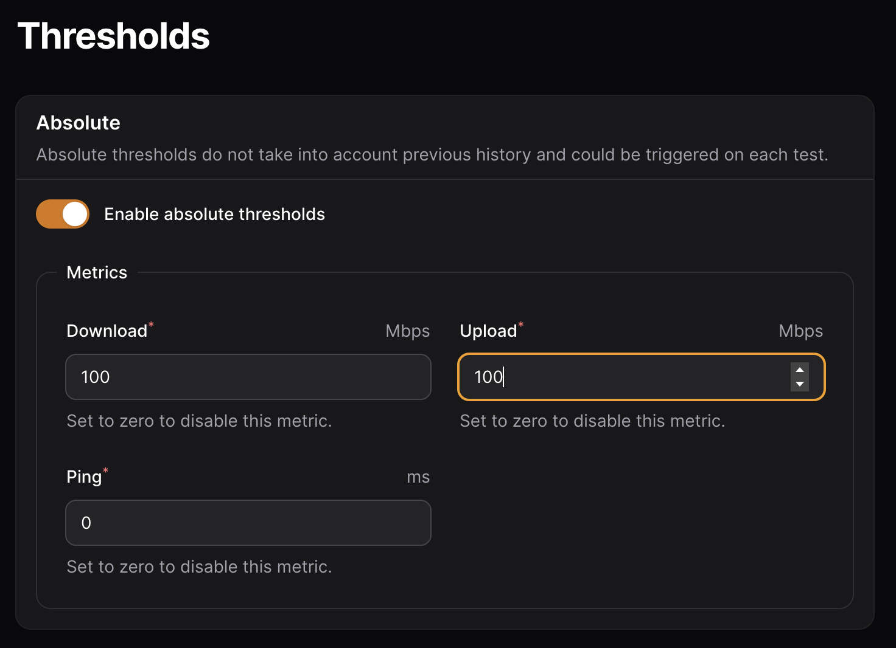

# gluebot

A basic container that auto-restarts gluetun at a specified time or if your speedtest is below a certain download speed, upload speed, or ping time.



This is a personal container I built for my own use. I was encouraged to make it public. It comes with no support or planned future releases.

There are three modes of operation:

* Timed daily restart of gluetun. Via setting an 24hr time, like 19:10 for 7:10pm.
* Restart based on speedtest-tracker container (lscr.io/linuxserver/speedtest-tracker) results. Gluebot listens on port 4040. ANY post to this port will trigger a restart.
* Both timed daily restart and speedtest-tracker results.

Requirements:

* Timed restart: An existing gluetun docker compose file. As of the current gluetun release, the API is open and doesn't require authentication. Future gluetun releases will require the config.toml file to be defined. Gluebot supports both.
* Speedtest restart: Requires a functioning lscr.io/linuxserver/speedtest-tracker container inside your gluetun network. And the gluebot webhook url and thresholds defined in speedtest-tracker.

Environment options:

```
API_KEY=                # optional, but required for secured gluetun API.
CONTROL_SERVER_PORT=    # optional. defaults to 8000.
RESTART_TIME=           # optional, but required for timed restarts.
TZ=                     # optional. defaults to UTC.
```

Basic timed restart without API auth, gluetun api on port 9090:
```
  gluebot:
    container_name: gluebot
    image: ghcr.io/razer11528-maker/gluebot:latest
    environment:
      - CONTROL_SERVER_PORT=9090
      - RESTART_TIME=19:10
      - TZ=Europe/London
    network_mode: "service:gluetun"
    restart: unless-stopped
```


Timed restart with API auth:
```
  gluebot:
    container_name: gluebot
    image: ghcr.io/razer11528-maker/gluebot:latest
    environment:
      - API_KEY=SUperS3cretK3y
      - RESTART_TIME=19:10
      - TZ=Europe/London
    network_mode: "service:gluetun"
    restart: unless-stopped
```


Timed and speedtest restart with API auth (webhook and threshholds must be defined in speedtest container):
```
  gluebot:
    container_name: gluebot
    image: ghcr.io/razer11528-maker/gluebot:latest
    environment:
      - API_KEY=SUperS3cretK3y
      - RESTART_TIME=19:10
      - TZ=Europe/London
    network_mode: "service:gluetun"
    restart: unless-stopped
```

Only speedtest restart with API auth (webhook and threshholds must be defined in speedtest container):
```
  gluebot:
    container_name: gluebot
    image: ghcr.io/razer11528-maker/gluebot:latest
    environment:
      - API_KEY=SUperS3cretK3y
      - CONTROL_SERVER_PORT=8000
      - TZ=Europe/London
    network_mode: "service:gluetun"
    restart: unless-stopped
```



